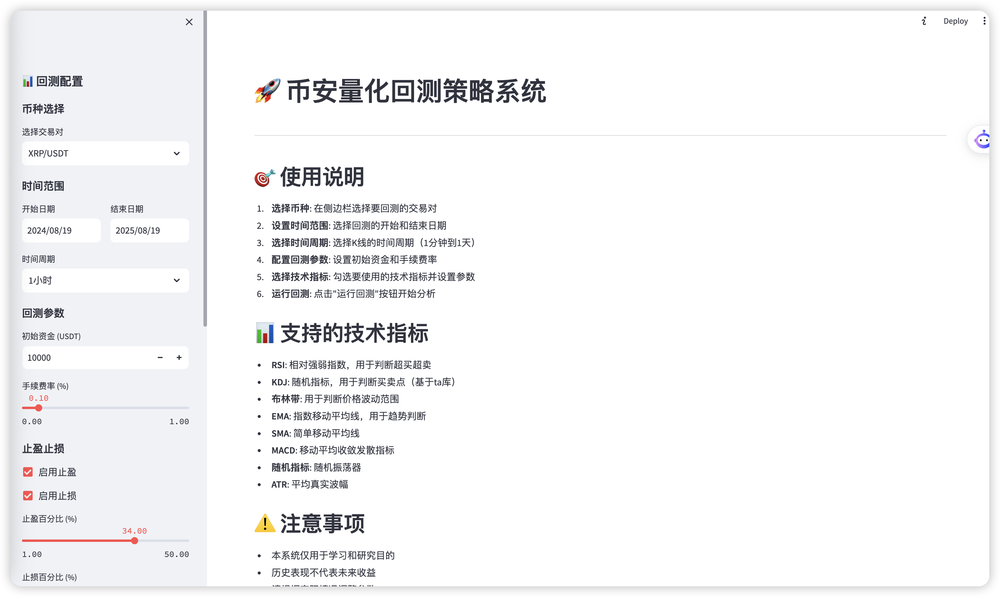

# 币安量化回测策略系统 / Binance Quantitative Backtesting Strategy System

[English](#english) | [中文](#chinese)

---



## English

### 🚀 Overview

A comprehensive quantitative backtesting system for Binance cryptocurrency trading, featuring interactive web interface, multiple technical indicators, and advanced risk management tools.

### ✨ Features
- **官网**: https://www.dingpandog.com
- https://github.com/Maikefee/DingPanDog/wiki
- **🪙 Multi-Currency Support**: All Binance USDT trading pairs
- **📅 Flexible Time Range**: Customizable backtesting periods
- **📊 Technical Indicators**: RSI, KDJ, Bollinger Bands, EMA, SMA, MACD, Stochastic, ATR
- **⚙️ Customizable Parameters**: Adjustable indicator parameters
- **💰 Risk Management**: Take profit and stop loss functionality
- **📈 Interactive Charts**: Real-time visualization with Plotly
- **📋 Trade Records**: Detailed transaction history and export
- **🎯 Performance Metrics**: Comprehensive performance analysis

### 🛠️ Installation

1. **Clone the repository**
```bash
git clone <repository-url>
cd TestPro1
```

2. **Install dependencies**
```bash
pip install -r requirements.txt
```

3. **Run the application**
```bash
python run.py
# or
streamlit run app.py
```

4. **Access the web interface**
Open your browser and navigate to `http://localhost:8501`

### 📊 Supported Technical Indicators

- **RSI**: Relative Strength Index for overbought/oversold signals
- **KDJ**: Stochastic oscillator for buy/sell signals (based on ta library)
- **Bollinger Bands**: Price volatility range analysis
- **EMA**: Exponential Moving Average for trend analysis
- **SMA**: Simple Moving Average
- **MACD**: Moving Average Convergence Divergence
- **Stochastic**: Stochastic oscillator
- **ATR**: Average True Range

### 🎯 Risk Management Features

- **Take Profit**: Automatically close positions when profit target is reached
- **Stop Loss**: Automatically close positions when loss limit is reached
- **Performance Tracking**: Monitor take profit and stop loss effectiveness
- **Risk Metrics**: Maximum drawdown, Sharpe ratio, win rate analysis

### 📁 Project Structure

```
TestPro1/
├── app.py              # Main Streamlit application
├── data_fetcher.py     # Binance data retrieval module
├── indicators.py       # Technical indicator calculations
├── backtest_engine.py  # Backtesting engine with risk management
├── chart_utils.py      # Chart visualization tools
├── config.py           # Configuration settings
├── run.py              # Application launcher
├── requirements.txt    # Python dependencies
└── README.md           # Documentation
```

### 🔧 Usage

1. **Select Trading Pair**: Choose from available Binance USDT pairs
2. **Set Time Range**: Define backtesting start and end dates
3. **Choose Timeframe**: Select K-line intervals (1m to 1d)
4. **Configure Parameters**: Set initial capital, commission, and risk management
5. **Select Indicators**: Choose and configure technical indicators
6. **Run Backtest**: Execute the analysis and view results
7. **Analyze Results**: Review performance metrics and charts

### ⚠️ Disclaimer

- This system is for educational and research purposes only
- Historical performance does not guarantee future returns
- Please adjust parameters based on actual market conditions
- Thorough testing is recommended before live trading

### 📈 Performance Metrics

- Total Return and Annualized Return
- Maximum Drawdown Analysis
- Sharpe Ratio Calculation
- Win Rate Statistics
- Take Profit/Stop Loss Effectiveness
- Trade Record Export

---

## 中文

### 🚀 系统概述

一个功能完整的币安加密货币量化回测系统，具备交互式Web界面、多种技术指标和先进的风险管理工具。

### ✨ 功能特点

- **🪙 多币种支持**: 支持所有币安USDT交易对
- **📅 灵活时间范围**: 可自定义回测时间段
- **📊 技术指标**: RSI、KDJ、布林带、EMA、SMA、MACD、随机指标、ATR
- **⚙️ 参数自定义**: 可调整的指标参数
- **💰 风险管理**: 止盈止损功能
- **📈 交互式图表**: 基于Plotly的实时可视化
- **📋 交易记录**: 详细的交易历史和导出功能
- **🎯 性能指标**: 全面的性能分析

### 🛠️ 安装说明

1. **克隆仓库**
```bash
git clone <repository-url>
cd TestPro1
```

2. **安装依赖**
```bash
pip install -r requirements.txt
```

3. **运行应用**
```bash
python run.py
# 或者
streamlit run app.py
```

4. **访问Web界面**
打开浏览器访问 `http://localhost:8501`

### 📊 支持的技术指标

- **RSI**: 相对强弱指数，用于超买超卖信号
- **KDJ**: 随机指标，用于买卖信号（基于ta库）
- **布林带**: 价格波动范围分析
- **EMA**: 指数移动平均线，用于趋势分析
- **SMA**: 简单移动平均线
- **MACD**: 移动平均收敛发散指标
- **随机指标**: 随机振荡器
- **ATR**: 平均真实波幅

### 🎯 风险管理功能

- **止盈**: 达到盈利目标时自动平仓
- **止损**: 达到亏损限制时自动平仓
- **效果跟踪**: 监控止盈止损效果
- **风险指标**: 最大回撤、夏普比率、胜率分析

### 📁 项目结构

```
TestPro1/
├── app.py              # 主Streamlit应用程序
├── data_fetcher.py     # 币安数据获取模块
├── indicators.py       # 技术指标计算
├── backtest_engine.py  # 带风险管理的回测引擎
├── chart_utils.py      # 图表可视化工具
├── config.py           # 配置文件
├── run.py              # 应用启动器
├── requirements.txt    # Python依赖
└── README.md           # 文档说明
```

### 🔧 使用方法

1. **选择交易对**: 从可用的币安USDT交易对中选择
2. **设置时间范围**: 定义回测的开始和结束日期
3. **选择时间周期**: 选择K线间隔（1分钟到1天）
4. **配置参数**: 设置初始资金、手续费和风险管理
5. **选择指标**: 选择并配置技术指标
6. **运行回测**: 执行分析并查看结果
7. **分析结果**: 查看性能指标和图表

### ⚠️ 免责声明

- 本系统仅供学习和研究使用
- 历史表现不代表未来收益
- 请根据实际市场情况调整参数
- 建议在实盘交易前充分测试

### 📈 性能指标

- 总收益率和年化收益率
- 最大回撤分析
- 夏普比率计算
- 胜率统计
- 止盈止损效果分析
- 交易记录导出

---

## 🚀 盯盘狗量化策略 / Automated Trading Strategy

### 📈 实盘收益展示 / Live Trading Performance

**我们这个策略其实就是靠自动化在炒币，整个流程非常简单：**
- 它会一直监控市面上 50 多个币种
- 一旦发现有开仓信号，就会自动下单开仓

**收益表现 / Performance:**
- 📈 **3天收益 133%**
- 📈 **8天收益 242%** 
- 🔥 **最猛那轮，17天收益飙到 553%**

### 📱 联系方式 / Contact
- **官网**: https://www.dingpandog.com
- **Telegram**: https://t.me/whogotbtc
- **Telegram群**: https://t.me/shipanjiankong  
- **微信联系**: rggboom

---

## 📞 Support / 支持

For questions or issues, please open an issue in the repository.

如有问题或建议，请在仓库中提交issue。

---

## 📄 License / 许可证

This project is licensed under the MIT License.

本项目采用MIT许可证。
